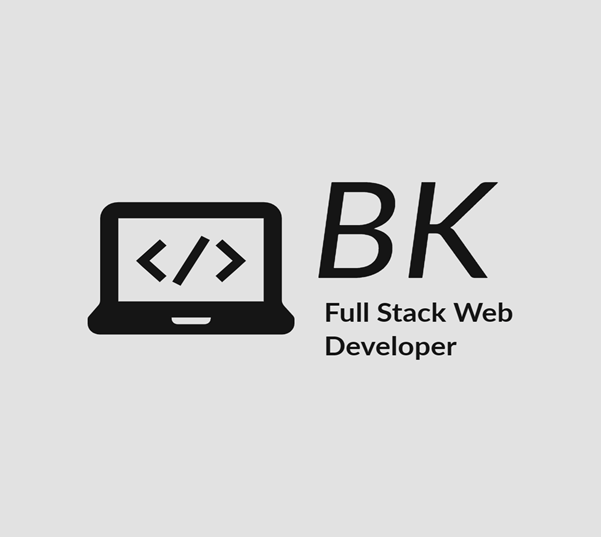

<a name="readme-top"></a>

<div align="center">
  <!-- You are encouraged to replace this logo with your own! Otherwise you can also remove it. -->
  
  <br/>

  <!-- <h3><b> README Template</b></h3> -->

</div>

<!-- TABLE OF CONTENTS -->

# Workcations Tailwind Project

## Table of Contents
- [Workcations Tailwind Project](#workcations-tailwind-project)
  - [Table of Contents](#table-of-contents)
  - [About the Project](#about-the-project)
    - [Built With](#built-with)
    - [Live Demo](#live-demo)
  - [Getting Started](#getting-started)
    - [Expanding the ESLint configuration](#expanding-the-eslint-configuration)
  - [👥 Authors ](#-authors-)
  - [Future Features](#future-features)
  - [Contributing](#contributing)
  - [Show your support](#show-your-support)
  - [Acknowledgements](#acknowledgements)
  - [License](#license)

## About the Project
Welcome!<br> This is a dynamic React application, meticulously crafted with TypeScript.<br> My primary objective?<br> To master the art of responsive design using nothing but Tailwind CSS thus exploring the power of modern web development!

### Built With
This project was built using these technologies:
- [React](https://reactjs.org/)
- [TypeScript](https://www.typescriptlang.org/)
- [Tailwind CSS](https://tailwindcss.com/)
- [Vite](https://vitejs.dev/)

### Live Demo
Live demo of the project coming soon: [Live Demo Link](http://www.example.com)

## Getting Started
To get a local copy up and running follow these simple steps:
1. Clone the repository
2. Install dependencies using `npm install`
3. Start the server using `npm run dev`

  ### Expanding the ESLint configuration

If you are developing a production application, we recommend updating the configuration to enable type aware lint rules:

- Configure the top-level `parserOptions` property like this:

```js
export default {
  // other rules...
  parserOptions: {
    ecmaVersion: 'latest',
    sourceType: 'module',
    project: ['./tsconfig.json', './tsconfig.node.json'],
    tsconfigRootDir: __dirname,
  },
}
```

- Replace `plugin:@typescript-eslint/recommended` to `plugin:@typescript-eslint/recommended-type-checked` or `plugin:@typescript-eslint/strict-type-checked`
- Optionally add `plugin:@typescript-eslint/stylistic-type-checked`
- Install [eslint-plugin-react](https://github.com/jsx-eslint/eslint-plugin-react) and add `plugin:react/recommended` & `plugin:react/jsx-runtime` to the `extends` list

## 👥 Authors <a name="authors"></a>

 👤 **Benson Kiai**
- GitHub: [@BenMKT](https://github.com/BenMKT)
- LinkedIn: [Benson Kiai](https://www.linkedin.com/in/bensonkiai)

## Future Features
- Live Demo
- Feature2
- Feature3

## Contributing
I welcome educational contributions to enhance the functionality and user experience of the landing page using TailwindCSS. If you have any ideas, suggestions, or bug reports, feel free to open an issue or submit a pull request. Let's share ideas!

If you'd like to contribute to this project, please follow these steps:

1. Fork the repository.
2. Create a new branch for your feature or bug fix.
3. Make your changes and commit them with descriptive commit messages.
4. Push your changes to your forked repository.
5. Submit a pull request to the main repository, explaining your changes in detail.

Please adhere to the coding conventions and guidelines specified in the project.

Feel free to check the [issues page](https://github.com/BenMKT/tailwind-project/issues).

## Show your support
If you encounter any issues or have any questions or suggestions, please open an issue on the [issue tracker](https://github.com/BenMKT/tailwind-project/issues).

Furthermore, if you would like to get in touch with me, you can find our contact information in the <a href="#authors">Authors</a> section.

## Acknowledgements
- Thanks to everyone who contributed to this project .

## License
This project is [MIT](./LICENSE) licensed.

<!-- _NOTE: we recommend using the [MIT license](https://choosealicense.com/licenses/mit/) - you can set it up quickly by [using templates available on GitHub](https://docs.github.com/en/communities/setting-up-your-project-for-healthy-contributions/adding-a-license-to-a-repository). You can also use [any other license](https://choosealicense.com/licenses/) if you wish._ -->

<p align="right">(<a href="#readme-top">back to top</a>)</p>
